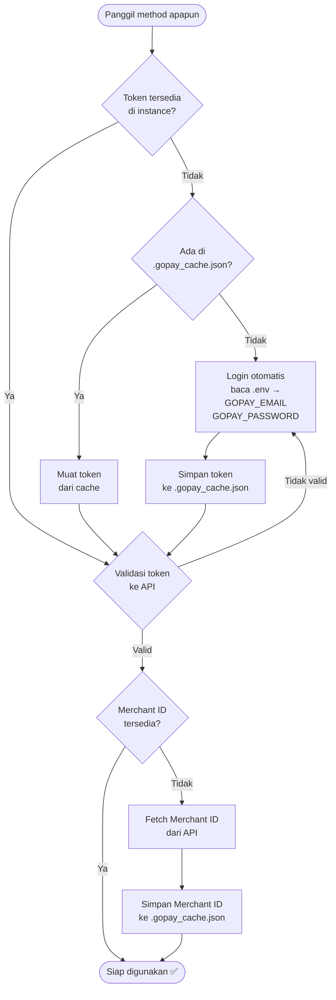

# GoPay Payment

<p align="center">
  
  
  
  
  

</p>

Modul Node.js untuk berinteraksi dengan API GoBiz (GoPay Merchant) — memungkinkan pengambilan riwayat transaksi dan pemantauan pembayaran masuk secara real-time menggunakan polling otomatis.

> [!WARNING]
> **Peringatan Risiko Banned:** Penggunaan otomatisasi login atau polling API yang terlalu sering dan agresif berisiko membuat akun GoBiz Anda terdeteksi dan terkena **banned/blokir**. Penggunaan modul ini sepenuhnya merupakan tanggung jawab Anda sendiri.

---

## ✨ Fitur Utama

- 🔐 **Autentikasi Otomatis** — Login menggunakan email & password, token disimpan dan diperbarui otomatis
- 🏪 **Deteksi Merchant ID** — Merchant ID dideteksi secara otomatis dari akun yang login
- 📋 **Riwayat Transaksi** — Ambil transaksi dari Analytics API maupun Journal API dengan fallback otomatis
- 👁️ **Pemantauan Pembayaran** — Pantau transaksi masuk secara real-time dengan polling interval
- ⏳ **Tunggu Pembayaran** — Await pembayaran dengan nominal tertentu + toleransi + timeout
- ♻️ **Singleton Watcher** — `getGoPayWatcher()` selalu mengembalikan instance yang sama; polling hanya berjalan sekali meski dipanggil dari banyak tempat

---

## 📦 Instalasi

Clone repo ini lalu install dependensi:

```bash
git clone https://github.com/kavionn/gopay.git
cd gopay
npm install
```

---

## 🔑 Cara Mengatur Password Akun GoBiz

Modul ini memerlukan **email & password** untuk login ke API GoBiz. Jika kamu belum memiliki password (atau belum pernah mengaturnya), ikuti langkah berikut:

1. **Buka portal GoFood Merchant**
   Kunjungi → [https://portal.gofoodmerchant.co.id](https://portal.gofoodmerchant.co.id)

2. **Login menggunakan OTP**
   Masukkan nomor HP yang terdaftar, lalu masukkan kode OTP yang dikirim via SMS.

3. **Buka halaman Profile**
   Setelah berhasil login, pergi ke:
   [https://portal.gofoodmerchant.co.id/account/profile](https://portal.gofoodmerchant.co.id/account/profile)

4. **Atur password login**
   Di halaman profile, cari opsi untuk mengatur atau mengubah **password login**, lalu simpan.

5. **Gunakan kredensial di `.env`**
   Setelah password berhasil diatur, gunakan email & password tersebut di file `.env`:
   ```env
   GOPAY_EMAIL=email@merchant.com
   GOPAY_PASSWORD=password_yang_baru_diatur
   ```

---

## ⚙️ Konfigurasi

### File `.env`

Buat file `.env` di direktori yang **sama** dengan `gobiz.js` dan isi dengan kredensial akun GoBiz Merchant:

```env
GOPAY_EMAIL=email@merchant.com
GOPAY_PASSWORD=password_kamu
```

### File `.gopay_cache.json` *(dibuat otomatis)*

Modul ini akan **membuat sendiri** file `.gopay_cache.json` di direktori yang sama saat pertama kali login berhasil. File ini menyimpan token dan merchant ID agar tidak perlu login ulang setiap kali aplikasi dijalankan.

Contoh isi file yang dibuat otomatis:

```json
{
  "gopay_token": "eyJhbGci...",
  "gopay_merchant_id": "M-XXXXXXXX"
}
```

> **Catatan:** Token yang kadaluarsa akan di-refresh otomatis — kamu tidak perlu mengubah file ini secara manual.

---

## 🚀 Cara Penggunaan

> [!WARNING]
> **⚠️ Risiko Akun Terkena Ban:** Modul ini mengakses API internal GoBiz yang tidak resmi. Penggunaan yang tidak bijak (polling terlalu agresif, terlalu banyak request, dll.) berisiko membuat akun kamu **diblokir oleh Gojek**. Untuk meminimalisir risiko, gunakan metode **[cek manual](#2-mengambil-riwayat-transaksi--direkomendasikan-untuk-anti-ban)** dengan `getHistory` setiap 2–5 menit, daripada mengandalkan `GoPayWatcher` dengan interval sangat pendek. Penggunaan sepenuhnya menjadi **tanggung jawab kamu sendiri**.

### 1. Menunggu Pembayaran Masuk

Cara paling umum — tunggu hingga ada pembayaran dengan nominal tertentu masuk.

```js
import { getGoPayWatcher } from './gobiz.js';

const watcher = getGoPayWatcher();

try {
  const tx = await watcher.waitForPayment(50000, {
    timeout: 5 * 60_000, // 5 menit
    tolerance: 0         // toleransi selisih nominal (Rp)
  });

  console.log('✅ Pembayaran diterima!');
  console.log('Nominal     :', tx.amount);
  console.log('ID Transaksi:', tx.txId);
  console.log('Detail      :', tx.entry);
} catch (err) {
  console.error('❌', err.message); // timeout atau error lain
}
```

**Parameter `waitForPayment`:**

| Parameter   | Tipe     | Default   | Keterangan                             |
|-------------|----------|-----------|----------------------------------------|
| `amount`    | `number` | *(wajib)* | Nominal yang ditunggu (dalam Rupiah)   |
| `timeout`   | `number` | `300000`  | Batas waktu dalam milidetik (5 menit)  |
| `tolerance` | `number` | `0`       | Toleransi selisih nominal (Rupiah)     |

---

### 2. Mengambil Riwayat Transaksi ⭐ *(Direkomendasikan untuk Anti-Ban)*

> [!TIP]
> Pendekatan ini **jauh lebih aman** dari sisi risiko ban karena kamu yang mengontrol kapan dan seberapa sering request dilakukan. Gunakan ini sebagai pengganti `GoPayWatcher` jika memungkinkan.

```js
import GoPayMerchant from './gobiz.js';

const merchant = new GoPayMerchant();

// ✅ Panggil ini secara manual setiap 2-5 menit, BUKAN dalam loop cepat
const result = await merchant.getHistory({ days: 1, size: 20 });

if (result.status) {
  for (const tx of result.data.histories) {
    console.log(tx.amount.displayed_text, '—', tx.time);
  }
} else {
  console.error('Gagal:', result.message);
}
```

**Contoh pola cek manual yang aman (setiap 3 menit):**

```js
import GoPayMerchant from './gobiz.js';

const merchant = new GoPayMerchant();
const INTERVAL_MS = 3 * 60 * 1000; // 3 menit — aman dari risiko ban

async function cekTransaksi() {
  const result = await merchant.getHistory({ days: 1, size: 10 });
  if (result.status) {
    const transaksi = result.data.histories;
    console.log(`[${new Date().toLocaleTimeString()}] Ditemukan ${transaksi.length} transaksi`);
    // proses transaksi di sini...
  }
}

// Jalankan pertama kali, lalu ulang setiap INTERVAL_MS
cekTransaksi();
setInterval(cekTransaksi, INTERVAL_MS);
```

**Parameter `getHistory`:**

| Parameter | Tipe     | Default | Keterangan                              |
|-----------|----------|---------|-----------------------------------------|
| `days`    | `number` | `1`     | Rentang hari ke belakang                |
| `size`    | `number` | `50`    | Jumlah maksimum transaksi yang diambil  |

**Struktur item `histories`:**

```js
{
  type: "payin",
  amount: {
    displayed_text: "Rp 50000"
  },
  time: "15 Jun 2026 - 13:00:00",
  raw: { /* objek transaksi mentah dari API */ }
}
```

---

### 3. Inisialisasi Manual dengan Token & Merchant ID

Jika kamu sudah memiliki access token dan merchant ID, bisa langsung diisi tanpa proses login:

```js
import GoPayMerchant from './gobiz.js';

const merchant = new GoPayMerchant({
  token: 'eyJhbGci...',     // opsional
  merchantId: 'M-XXXXXXXX' // opsional
});

const result = await merchant.getHistory({ days: 7, size: 100 });
```

> Jika `token` atau `merchantId` tidak diisi, keduanya akan di-resolve otomatis saat method pertama dipanggil.

---

### 4. Mendengarkan Event Pembayaran Secara Manual


`GoPayWatcher` adalah EventEmitter — kamu bisa langsung listen event `'payment'`:

```js
import { getGoPayWatcher } from './gobiz.js';

const watcher = getGoPayWatcher(10_000); // polling tiap 10 detik

watcher.on('payment', (data) => {
  console.log('💸 Pembayaran masuk!');
  console.log('Nominal     :', data.amount);
  console.log('ID Transaksi:', data.txId);
});
```

> Poller akan **otomatis berjalan** saat ada listener aktif dan **berhenti** saat semua listener dihapus.

---

### 5. Reset Watcher

Berguna saat testing agar transaksi lama bisa terdeteksi ulang:

```js
import { getGoPayWatcher } from './gobiz.js';

const watcher = getGoPayWatcher();
watcher.reset();
// Semua ID transaksi yang diingat dihapus, seed ulang dimulai.
```

---

## 📖 API Reference

### `default export: GoPayMerchant`

Kelas utama untuk berinteraksi dengan API GoBiz Merchant.

| Method                                    | Keterangan                                                          |
|-------------------------------------------|---------------------------------------------------------------------|
| `constructor(options?)`                   | `options.token` dan `options.merchantId` bersifat opsional          |
| `async init()`                            | Inisialisasi: validasi/refresh token & resolve merchant ID          |
| `async getHistory({ days, size })`        | Ambil riwayat transaksi (fallback Analytics → Journal)              |
| `async getTransactionsAnalytics({ ... })` | Ambil transaksi dari Analytics API secara langsung                  |
| `async getTransactionsJournal({ ... })`   | Ambil transaksi dari Journal API secara langsung                    |

---

### `export class: GoPayWatcher`

Kelas pemantau pembayaran berbasis `EventEmitter`.

| Method                          | Keterangan                                                          |
|---------------------------------|---------------------------------------------------------------------|
| `constructor(merchant, intervalMs?)` | `merchant` adalah instance `GoPayMerchant`, `intervalMs` default `7000` ms |
| `waitForPayment(amount, opts?)`  | Tunggu pembayaran nominal tertentu, returns `Promise`               |
| `on('payment', callback)`        | Dengarkan event pembayaran masuk                                    |
| `reset()`                        | Reset seed (hapus semua ID transaksi yang diingat)                  |

**Event `'payment'`** memancarkan objek:

```js
{
  amount: 50000,    // nominal dalam Rupiah (number)
  txId: "TXN-...", // ID unik transaksi
  entry: { ... }   // objek riwayat lengkap dari getHistory
}
```

---

### `export function: getGoPayWatcher(intervalMs?)`

Mengembalikan instance `GoPayWatcher` singleton. Setiap kali fungsi ini dipanggil — dari file mana pun dalam satu proses — akan selalu mengembalikan instance yang **sama**, sehingga hanya ada **satu proses polling** yang berjalan di background.

```js
import { getGoPayWatcher } from './gobiz.js';

const watcher = getGoPayWatcher(7_000); // default 7 detik
```

---

## 🔄 Alur Autentikasi



---

## ⚠️ Catatan Penting

- 🚨 **Risiko Banned Akun:** Penggunaan library pihak ketiga untuk mengakses API internal GoBiz memiliki risiko pemblokiran akun. Selalu gunakan interval pengecekan yang wajar dan hindari polling yang terlalu agresif.
- Modul ini menggunakan `execFileSync('curl', ...)` untuk proses login — pastikan `curl` tersedia di sistem
- Email & password dibaca dari file `.env` di direktori yang sama dengan `gobiz.js`
- Token & merchant ID disimpan ke `.gopay_cache.json` yang **dibuat otomatis** — tidak perlu konfigurasi tambahan
- Token yang kadaluarsa akan di-refresh otomatis saat request gagal dengan status `401`
- Cache ID transaksi di `GoPayWatcher` dibatasi **500 entri** untuk mencegah memory leak
- Modul ini **bukan** library resmi Gojek/GoPay
- Tambahkan `.env`, `.gopay_cache.json`, dan `node_modules/` ke `.gitignore` untuk keamanan

---

## 📁 Struktur Export

```js
// Default export
import GoPayMerchant from './gobiz.js';

// Named exports
import { GoPayWatcher, getGoPayWatcher } from './gobiz.js';
```

---

## Star History

<a href="https://www.star-history.com/?repos=kavionn%2Fgopay&type=timeline&logscale=&legend=bottom-right">
 <picture>
   <source media="(prefers-color-scheme: dark)" srcset="https://api.star-history.com/chart?repos=kavionn/gopay&type=timeline&theme=dark&logscale&legend=bottom-right" />
   <source media="(prefers-color-scheme: light)" srcset="https://api.star-history.com/chart?repos=kavionn/gopay&type=timeline&logscale&legend=bottom-right" />
   
 </picture>
</a>
